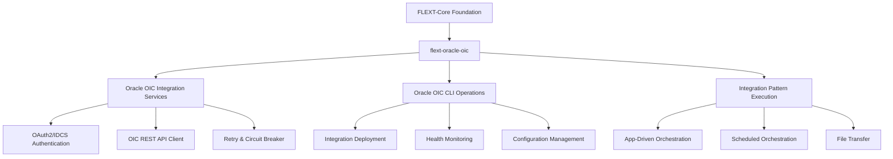

# flext-oracle-oic

[](https://www.python.org/downloads/)

**Oracle Integration Cloud client library for the FLEXT ecosystem** providing **OAuth2/IDCS authentication** and **integration pattern execution** using **FlextService patterns** with **professional OIC 2025 architecture**.

> **⚠️ STATUS**: Early Development (v0.9.9) - Foundation implemented, requires FLEXT compliance and Oracle OIC 2025 patterns

---

## 🎯 Purpose and Role in FLEXT Ecosystem

### **For the FLEXT Ecosystem**

This extension provides Oracle Integration Cloud (OIC) integration capabilities for FLEXT projects requiring Oracle cloud connectivity. It implements OAuth2/IDCS authentication, integration pattern execution, and enterprise Oracle cloud operations following FLEXT architectural standards.

### **Key Responsibilities**

1. **Oracle OIC Authentication** - OAuth2 client credentials flow with IDCS Gen3 simplifications
2. **Integration Pattern Execution** - App-driven orchestration, scheduled orchestration, file transfer patterns
3. **FLEXT Integration** - FlextService architecture with FlextResult railway patterns
4. **Enterprise Security** - Secure credential management with encryption and token lifecycle

### **Integration Points**

- **[flext-core](https://github.com/organization/flext/tree/main/flext-core/README.md)** → Uses FlextResult, FlextService, FlextContainer for foundation patterns
- **[flext-api](https://github.com/organization/flext/tree/main/flext-api/README.md)** → HTTP client abstractions for Oracle OIC REST API operations
- **[flext-cli](https://github.com/organization/flext/tree/main/flext-cli/README.md)** → CLI interface for Oracle OIC deployment and management operations
- **[flext-tap-oracle-oic](https://github.com/organization/flext/tree/main/flext-tap-oracle-oic/README.md)** → Data extraction from Oracle Integration Cloud
- **[flext-target-oracle-oic](https://github.com/organization/flext/tree/main/flext-target-oracle-oic/README.md)** → Data loading to Oracle Integration Cloud

---

## 🏗️ Architecture and Patterns

### **FLEXT-Core Integration Status**

| Pattern             | Status | Description                                                       |
| ------------------- | ------ | ----------------------------------------------------------------- |
| **FlextResult[T]**  | 🟡 65% | Partial usage implemented, needs completion across all operations |
| **FlextService**    | 🔴 0%  | Not implemented - critical requirement for FLEXT compliance       |
| **FlextContainer**  | 🔴 0%  | Not implemented - dependency injection missing                    |
| **Unified Classes** | 🔴 15% | Multiple classes per module violate FLEXT patterns                |

> **Status**: 🔴 Critical · 1.0.0 Release Preparation | 🟡 Partial | 🟢 Complete

### **Architecture Diagram**



### **Current Implementation vs FLEXT Standards**

| Component                | Current State                | FLEXT Standard                 | Required Action                      |
| ------------------------ | ---------------------------- | ------------------------------ | ------------------------------------ |
| **Service Architecture** | Multiple classes per module  | Single FlextService per module | Refactor to unified pattern          |
| **Error Handling**       | Mixed FlextResult/exceptions | Consistent FlextResult railway | Complete pattern implementation      |
| **HTTP Client**          | Direct httpx usage           | flext-api abstractions         | Replace with FLEXT patterns          |
| **CLI Interface**        | Direct typer usage           | flext-cli patterns             | Implement FLEXT CLI interface        |
| **Testing**              | 21% unit tests only          | 70%+ with integration tests    | Add contract and integration testing |

---

## 🚀 Quick Start

### **Installation**

```bash
# FLEXT workspace setup (recommended)
cd /path/to/flext/workspace
git clone <repository-url> flext-oracle-oic
cd flext-oracle-oic

# Install dependencies
poetry install --with dev,test

# Verify installation
python -c "from flext_oracle_oic import OracleOicExtensionSettings; print('Import successful')"
```

### **Basic Usage**

```python
from flext_oracle_oic import (
    OracleOicExtensionSettings,
    FlextOracleOicConnectionSettings,
    FlextOracleOicAuthSettings
)

# Oracle OIC configuration
settings = OracleOicExtensionSettings(
    connection=FlextOracleOicConnectionSettings(
        base_url="https://your-oic-instance.integration.ocp.oraclecloud.com",
        api_version="v1",
        request_timeout=30
    ),
    auth=FlextOracleOicAuthSettings(
        oauth_client_id="your_client_id",
        oauth_client_secret="your_client_secret",
        oauth_token_url="https://your-idcs.identity.oraclecloud.com/oauth2/v1/token"
    )
)

# Note: Full FlextService implementation in development
# Current implementation provides configuration and basic patterns
```

### **Current Capabilities**

- ✅ **Configuration Management**: Pydantic models for Oracle OIC settings
- ✅ **Basic Authentication**: OAuth2/IDCS configuration framework
- ✅ **Module Structure**: Organized service and client architecture
- 🟡 **CLI Interface**: Basic commands available (needs flext-cli integration)
- ❌ **FLEXT Compliance**: Requires FlextService implementation
- ❌ **Production Integration**: OAuth2 Gen3 authentication needs completion

---

## 🔧 Quality Assurance

The FLEXT ecosystem provides comprehensive automated quality assurance:

- **Pattern Analysis**: Automatic detection of architectural violations and duplication
- **Consolidation Guidance**: SOLID-based refactoring recommendations
- **Batch Operations**: Safe, automated fixes with backup and rollback
- **Quality Gates**: Enterprise-grade validation before integration

### Development Standards

- **Architecture Compliance**: Changes maintain layering and dependencies
- **Type Safety**: Complete type coverage maintained
- **Test Coverage**: All changes include comprehensive tests
- **Quality Validation**: Automated checks ensure standards are met


## 🔧 Development

### **Essential Commands**

```bash
# Setup development environment
make setup                 # Complete development environment setup
poetry install --with dev,test

# Quality gates
make validate              # Complete validation pipeline (lint + type + test)
make check                 # Quick validation (lint + type-check only)
make lint                  # Ruff linting with zero tolerance
make type-check            # MyPy strict mode type checking
make test                  # Run test suite with coverage
make format                # Auto-format code with Ruff

# Development shortcuts
make t                     # Alias for test
make l                     # Alias for lint
make tc                    # Alias for type-check
make v                     # Alias for validate
```

### **Quality Gates**

Current quality requirements following FLEXT ecosystem standards:

- **Type Safety**: MyPy strict mode with zero tolerance for type errors
- **Code Quality**: Ruff linting with professional standards
- **Test Coverage**: Target 70%+ with meaningful integration tests
- **FLEXT Compliance**: Complete FlextService architecture implementation
- **Security**: Secure credential management and Oracle cloud authentication

---

## 🧪 Testing

### **Test Structure**

```
tests/
├── unit/                    # Unit tests for individual components
├── integration/             # Integration tests with Oracle OIC APIs
├── contract/                # Contract tests for API compliance
├── conftest.py             # Shared fixtures and utilities
└── test_*.py               # Current basic functionality tests
```

### **Testing Strategy**

Following FLEXT ecosystem testing patterns with Oracle OIC focus:

- **Unit Tests**: Component behavior with FlextResult patterns
- **Integration Tests**: Real Oracle OIC API interactions
- **Contract Tests**: Oracle OIC API compliance verification
- **Mock Tests**: Isolated testing with Oracle OIC endpoint mocking

### **Testing Commands**

```bash
make test                      # Complete test suite with coverage
make test-unit                 # Unit tests only (fast feedback)
make test-integration          # Integration tests with Oracle OIC
make test-contract             # Contract tests for API compliance
make coverage-html             # Generate HTML coverage report

# Specific test categories
pytest -m unit                 # Unit tests only
pytest -m integration          # Integration tests only
pytest -m oic                  # Oracle OIC specific tests
pytest tests/ --cov=src --cov-report=term-missing  # Coverage analysis
```

---

## 📊 Status and Metrics

### **Quality Standards**

Current status aligned with FLEXT ecosystem requirements:

- **Coverage**: 21% current, targeting 70% with integration tests
- **Type Safety**: MyPy strict mode compliance required (2 errors to resolve)
- **Security**: OAuth2/IDCS secure credential management needed
- **FLEXT-Core Compliance**: 20% - Critical architecture refactoring required

### **Ecosystem Integration**

**Direct Dependencies:**

- **[flext-core](https://github.com/organization/flext/tree/main/flext-core/README.md)** - Foundation patterns (FlextResult, FlextService, FlextContainer)
- **[flext-api](https://github.com/organization/flext/tree/main/flext-api/README.md)** - HTTP client abstractions for Oracle OIC REST operations
- **[flext-cli](https://github.com/organization/flext/tree/main/flext-cli/README.md)** - CLI framework for Oracle OIC management commands

**Service Dependencies:**

- **[flext-tap-oracle-oic](https://github.com/organization/flext/tree/main/flext-tap-oracle-oic/README.md)** - Depends on this for Oracle OIC data extraction
- **[flext-target-oracle-oic](https://github.com/organization/flext/tree/main/flext-target-oracle-oic/README.md)** - Depends on this for Oracle OIC data loading

**Integration Points:** 4 major connections with FLEXT ecosystem Oracle projects

### **Current Technical Debt**

**Critical Issues (Must Resolve):**

- FlextService inheritance not implemented
- FlextContainer dependency injection missing
- Direct httpx/typer imports violate FLEXT standards
- Mixed FlextResult/exception error handling patterns

**Oracle OIC 2025 Requirements:**

- OAuth2 Gen3 client credentials flow needed
- Integration pattern execution framework incomplete
- Circuit breaker and retry patterns missing
- Contract testing for API compliance required

---

## 🗺️ Roadmap

### **Current Version (v0.9.9)**

Foundation implemented with configuration management and basic service structure. FLEXT compliance refactoring required before production use.

### **Next Version (v0.9.1)**

**FLEXT Ecosystem Compliance:**

- Implement FlextService architecture patterns
- Replace direct imports with FLEXT abstractions
- Complete FlextResult railway pattern implementation
- Achieve zero MyPy errors in strict mode

### **Version 0.10.0**

**Oracle OIC 2025 Implementation:**

- OAuth2 Gen3 client credentials authentication
- Professional Oracle OIC REST client with retry patterns
- App-driven orchestration integration pattern
- 60-70% test coverage with integration testing

### **Future Versions**

**Enterprise Integration Patterns:**

- Scheduled orchestration and file transfer patterns
- Message routing and transformation capabilities
- Advanced monitoring and health checking
- Security hardening with credential encryption

---

## 📚 Documentation

- **[Getting Started](docs/getting-started.md)** - Installation and Oracle OIC setup
- **[Architecture](docs/architecture.md)** - FLEXT patterns and Oracle OIC integration
- **[API Reference](docs/api-reference.md)** - Complete API documentation
- **[Configuration](docs/configuration.md)** - OAuth2/IDCS settings and environment management
- **Development** - Contributing guidelines and FLEXT compliance (_Documentation coming soon_)
- **Integration** - FLEXT ecosystem integration patterns (_Documentation coming soon_)
- **Examples** - Oracle OIC integration examples (_Documentation coming soon_)
- **Troubleshooting** - Common Oracle cloud issues (_Documentation coming soon_)
- **[TODO & Roadmap](TODO.md)** - Evidence-based development roadmap

---

## 🤝 Contributing
### Quality Standards

All contributions must:
- Maintain architectural layering and dependency rules
- Preserve complete type safety
- Follow established testing patterns
- Pass automated quality validation


### **FLEXT-Core Compliance Checklist**

All contributions must meet FLEXT ecosystem standards:

- [ ] All changes pass `make validate` (lint + type + test)
- [ ] FlextService inheritance implemented
- [ ] FlextResult railway pattern used consistently
- [ ] FlextContainer dependency injection utilized
- [ ] No direct httpx/typer imports (use flext-api/flext-cli)
- [ ] Type safety maintained (zero MyPy errors in strict mode)

### **Oracle OIC Integration Requirements**

Professional Oracle Integration Cloud implementation standards:

- [ ] OAuth2 Gen3 client credentials flow compliance
- [ ] Circuit breaker and retry patterns for fault tolerance
- [ ] Contract testing for Oracle OIC API compliance
- [ ] Secure credential management with encryption
- [ ] Integration pattern testing with real Oracle OIC APIs

### **Quality Standards**

- **Type Safety**: MyPy strict mode with zero tolerance for type errors
- **Test Coverage**: 70% minimum with meaningful integration tests
- **FLEXT Compliance**: Complete ecosystem pattern implementation
- **Documentation**: Technical accuracy with working code examples
- **Security**: Secure Oracle cloud authentication and credential management

---

## 📄 License

MIT License - see [LICENSE](LICENSE) for details.

---

## 🆘 Support

- **Documentation**: [docs/](docs/)
- **Issues**: [GitHub Issues](https://github.com/flext-sh/flext-oracle-oic/issues)
- **Security**: Report security issues privately to maintainers
- **Oracle OIC**: Oracle Integration Cloud specific support and troubleshooting

---

**flext-oracle-oic v0.9.9** - Oracle Integration Cloud client library enabling secure OAuth2/IDCS authentication and professional integration pattern execution across the FLEXT ecosystem.

**Mission**: Provide a professional Oracle Integration Cloud library following FLEXT ecosystem standards that enables reliable, secure, and maintainable Oracle cloud integration solutions for enterprise Python applications.
